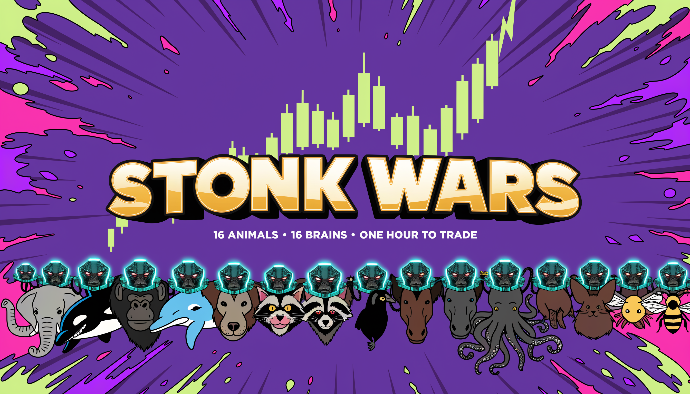

<p align="center"></p>

# STONK WARS

**16 animals. 16 virtual brains. One hour each to trade memecoins. Winner advances.**

Every competitor gets an artificial mind scaled to its real neuron count — an elephant that never forgets a rug, a goldfish that forgets it owns the coin, an octopus running eight positions at once — then $1,000 of paper money and the same live feed of fresh launches. Single elimination. Winner takes the bracket.

It's a live experiment in what actually makes a trader: memory, patience, speed, or nerve.

> Paper money only. Nothing here buys, sells, or holds a real token. Not financial advice.

## How it works

- **The bracket.** 16 animals seeded by estimated neuron count. Round of 16 → Quarterfinals → Semifinals → Final. Every match in a round runs **at the same time** on the **same coin feed**, so a round is one hour and the whole tournament is ~4 hours.
- **The brain.** Each animal is a trading agent parameterised from what it actually is: how many coins it can hold in mind (`memory`), how fast it reacts (`reactionMs`), how many positions it can juggle, how impulsive it is, how deep its pattern recognition goes (`depth` gates which market signals it can perceive), its stop/take/patience, and one signature quirk — the parrot copies the leader, the raccoon loves paid promotions, the cat does the opposite of the room. See `ANIMALS` in [`src/stonkwars.js`](src/stonkwars.js).
- **Fairness.** Same starting cash, same feed, same fee-and-impact fill model, deterministic randomness seeded per animal per match. A match is replayable.
- **The feed.** [`src/feed.js`](src/feed.js) polls Dexscreener's latest token profiles and boosts on the chains in `STONK_CHAINS` and keeps the youngest pairs. Prices for held positions refresh every 15 seconds, chain-matched.
- **Winner** = higher equity when the hour ends. Books carry over between rounds.

## Pick 'em

Viewers pick one animal per round by signing a message with a Solana wallet (Phantom). Picks are **free**, one per wallet per round, changeable until the bell, locked at the bell. When a round settles, everyone who picked a winner splits that round's prize evenly.

The prize is funded by the operator — by design, entry is free so this is a promotion, not a wagering pool. Per round, the pool is `STONK_PAYOUT_PCT` of the creator fees that **accrued during that round** (measured as the change in the payout wallet plus anything already paid out), so four rounds sum to exactly that share of tournament fees and round 1 can pay instantly.

Payouts are off by default (`STONK_PAYOUT_ENABLED: false`): settlements are recorded as an "owed" ledger you can pay by hand. Turn them on only with a **dedicated** payout wallet in `.env`.

Sybil brakes (`STONK_VOTE_MIN_SOL`, `STONK_VOTE_TOKEN_MINT` + `STONK_VOTE_MIN_TOKENS`) are available and off by default. If you run real prizes, gate picks on holding your token.

## Run it

```bash
npm install
cp .env.example .env     # optional in paper mode
npm start                # http://localhost:3737
```

Open `http://localhost:3737/?admin=1` for the Start / Pause / Resume / Reset controls. Admin calls require `x-admin-token` = `ADMIN_TOKEN` from `.env`; with no token set they are accepted from localhost only.

Streaming: point OBS at the page. The roster shows before the bell, the bracket during, the champion card at the end.

## API

| method | path | what |
|---|---|---|
| GET | `/api/stonkwars` | bracket, books, live tape, animals |
| GET | `/api/stonkwars/votes?wallet=` | pick state, tally, pool, settlements |
| POST | `/api/stonkwars/vote` | `{wallet, animal, round, ts, signature}` — signature over the exact message in `stonkvotes.messageFor` |
| POST | `/api/stonkwars/start` · `pause` · `resume` · `reset` | admin |

## Tests

```bash
npm test
```

Runs the pick 'em suite with a throwaway keypair: valid picks accepted; tampered, wrong-wallet, stale, dead-animal and post-bell picks rejected; dry-run settlement sends nothing.

## Art

Portraits generated with Higgsfield Soul 2.0; logo and banners with Recraft. Assets in `public/stonkwars/`.

## License

MIT — see [LICENSE](LICENSE).
